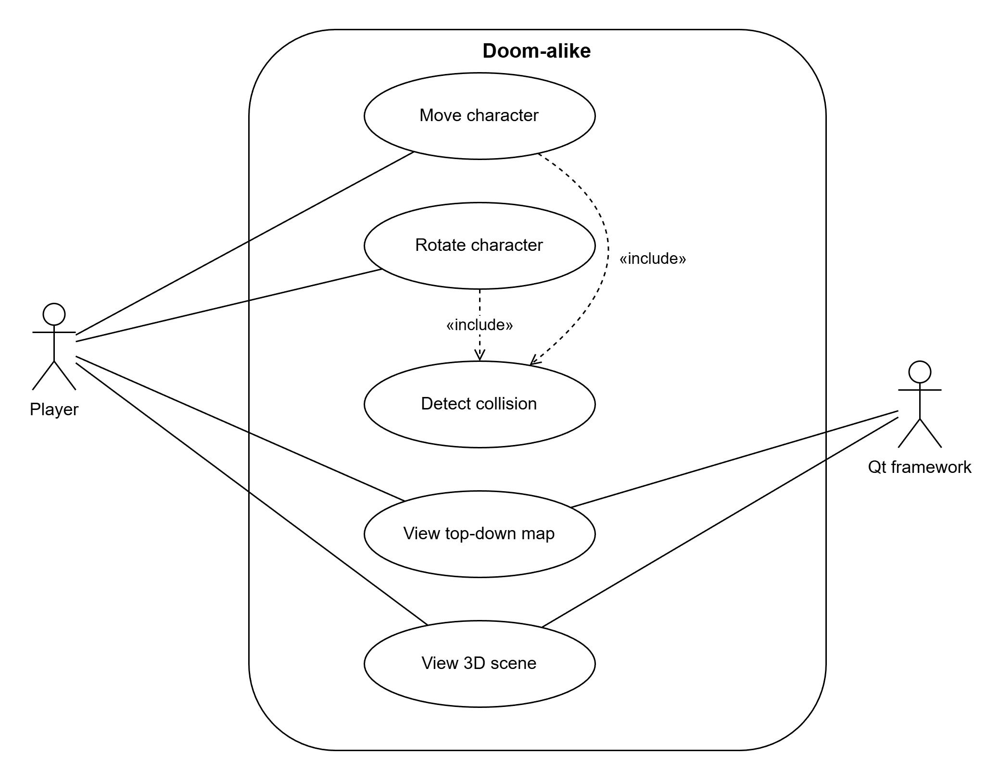
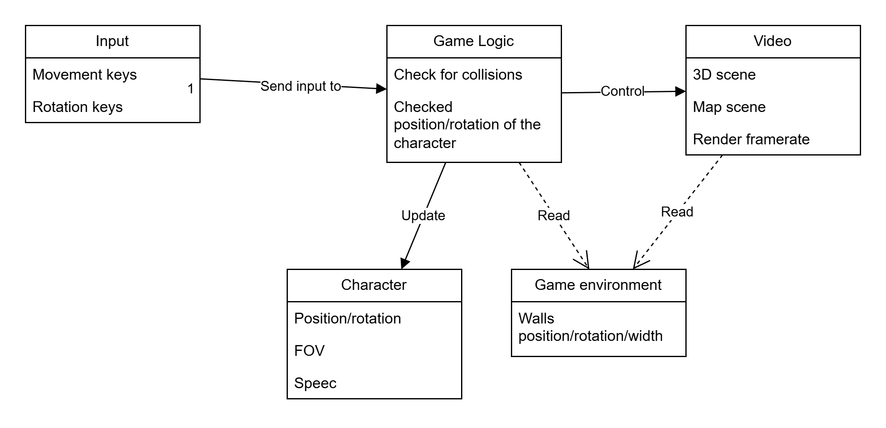

# Análise orientada a objeto

## << Descrição breve do domínio do desafio >>

Criar um jogo no estilo 2.5D, utilizando OOP. Identificar os objetos, a interação entre eles e elaborar a documentação.

## Diagrama de Caso de uso

Separei o framework Qt como um “ator separado” para detalhar o processo de interação do usuário com o programa

## Diagrama de Domínio do problema

Aqui é a representação abstrata dos objetos dentro do programa, sem métodos e entidades específicas do Qt, facilita a compreensão geral da estrutura

[Retroceder](../README.md) | [Avançar](projeto.md)

